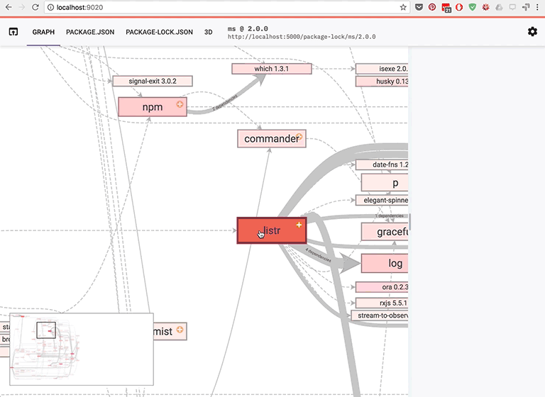

# NPM packages dependency browser.

NPM is the package manager for JavaScript. 
This project allows you to visualize the dependencies of NPM modules in the form of 2D (and 3D) graph;

### Client app

### Server

Basicaly the server is just a proxy to http://registry.npmjs.org.
Because of CORS restictions, we cannot call their API directly from the client. The primary purpose of server is to forward all requests to http://registry.npmjs.org. 
All the responses are cached.

## Development

1. Run the server

`sh tts.sh ./server/server` 

By default, the server listen to the port 5000.

2. Run the client in dev. mode

`npm run demo` 

### Other commands

`npm install`: install project dependency.

`npm run tsc`: run typeScript compiler.

`npm run build` build and bundle application with webpack.

`npm run test` bundle test files with webpack and run test with webComponent tester.

`npm run build:watch` bundle test files with webpack and watch on changes.

`npm run test:persist` bundle test files with webpack and watch on changes.

`npm run doc` generate project documentation with typedoc.

